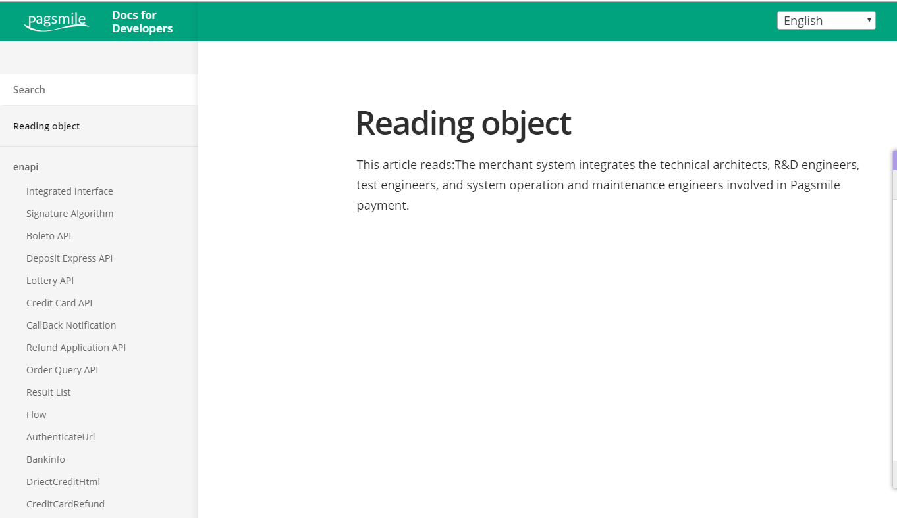

# edition_Template
文档api

Jekyll的产品文档模板。浏览[现场演示](https://long-pig.cloudvent.net/)。使用此可配置主题开始记录您的产品，应用程序，服务或网站。

版本由 [CloudCannon](http://cloudcannon.com/)制作, 且是Jekyll的Cloud CMS。

在[CloudCannon Academy](https://learn.cloudcannon.com/)查找更多模板,主题和分步Jekyll教程。

## 特征

* 两列布局
* 全文搜索
* 预先设计的组件
* 基于类别自动生产的导航
* 针对 [CloudCannon中的](http://cloudcannon.com/)编辑进行了优化
* 更改日志
* RSS/Atom提要
* SEO标签
* 谷歌分析

## 建立

1. 添加您的网站和作者详细信息 `_config.yml`.
2. 获取工作流程以查看您网站的输出 (使用 [CloudCannon](https://app.cloudcannon.com/) 或者 Jekyll本地)。

## 开发

版本是使用 [Jekyll](http://jekyllrb.com/) 版本 3.3.1, 但也支持更新版本（`_config.yml`中`imezone: Etc/UTC`注释）

使用 [Bundler](http://bundler.io/)安装依赖项:

~~~bash
$ bundle install
~~~

`jekyll`通过Bundle运行命令以确保您使用正确的版本:

~~~bash
$ bundle exec jekyll serve
~~~

## 编辑

Edition已针对在CloudCannon中添加，更新和删除文档界面进行了优化。

### 文档页面

* 在*Documentation* 集合中添加, 更新或删除文档页面。
* 更改文档页面的类别以将其移动到导航中的另一部分。
* 文档页面按类别在导航中组织, URL基于`_docs`文件夹内的路径。

### 更改日志

* 添加, 更新或删除帖子中的更改日志条目。
* 在最重要的事项中将条目标记为次要或主要。

### 搜索

* 添加 `excluded_in_search: true` 到任何文档页面的前端, 以在搜索结果后排除该页面。

### 导航

* 更改 `site.show_full_navigation` 以控制所有或仅当前正在打开的导航组。
